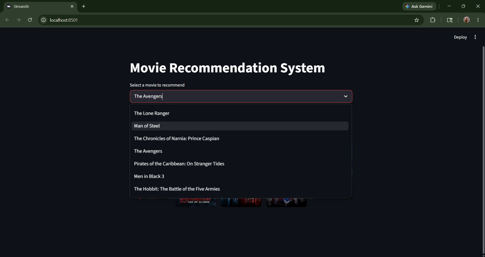
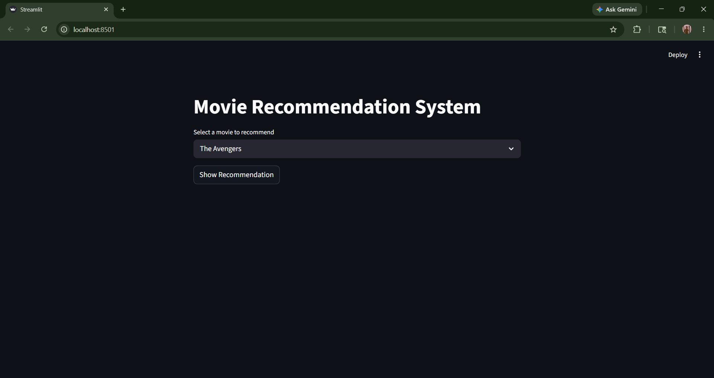
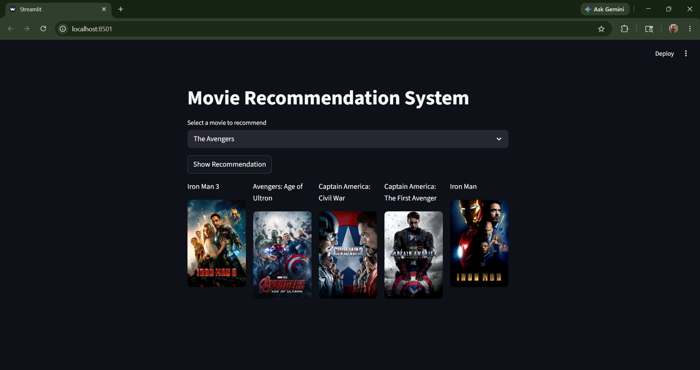

# 🎬 Movie Recommendation System

A complete end-to-end Machine Learning project that recommends similar movies based on content similarity using Python, Scikit-learn, and Streamlit. The system analyzes movie data, computes similarity scores, and provides real-time movie recommendations with posters fetched dynamically using the TMDB API.

---

## 📁 Project Structure

```text
MovieMind_Recommender/
│
├── jupyter_files/
│   ├── Movie_Recommend_System.ipynb    # Model building & preprocessing notebook
│   ├── tmdb_5000_movies.csv            # Movies dataset
│   └── tmdb_5000_credits.csv           # Credits dataset
│
├── app.py                              # Streamlit web application
├── requirements.txt                    # Required libraries
└── README.md
```

> ⚠️ `similarity.pkl` and `movie_dict.pkl` are not included due to file size limits.
> Run the Jupyter notebook first to generate them before launching the app.

---

## 🎯 Project Objective

To build a personalized movie recommendation system that helps users discover similar movies based on movie content and features instead of manual searching.

---

## 📦 Dataset

- **Source:** TMDB 5000 Movie Dataset
- **Dataset Type:** Movies & Credits Metadata
- **Key Features:** Genres, Keywords, Cast, Crew, Overview, Movie ID, Title, Popularity, Ratings

---

## 🛠️ Tools & Technologies

| Tool         | Purpose                                   |
| ------------ | ----------------------------------------- |
| Python       | Core Programming Language                 |
| Pandas       | Data Cleaning & Manipulation              |
| NumPy        | Numerical Operations                      |
| Scikit-learn | Machine Learning & Similarity Calculation |
| Streamlit    | Web Application Interface                 |
| Pickle       | Model Serialization                       |
| Requests API | Fetching Movie Posters                    |
| TMDB API     | Real-Time Movie Poster Integration        |

---

## 🔄 Project Workflow

### Phase 1 — Data Collection

- Loaded TMDB Movies and Credits datasets
- Merged datasets using movie title identifiers

---

### Phase 2 — Data Cleaning & Preprocessing

- Removed unnecessary columns
- Handled missing/null values
- Selected important attributes:
  - Genres
  - Keywords
  - Cast
  - Crew
  - Overview

---

### Phase 3 — Feature Engineering

- Combined important textual features into a single `tags` column
- Converted text into lowercase format
- Applied stemming and preprocessing techniques

---

### Phase 4 — Vectorization & Similarity Calculation

- Converted textual movie tags into vectors using text vectorization
- Calculated cosine similarity between movies
- Generated similarity matrix for recommendation logic

---

### Phase 5 — Model Serialization

Saved processed movie data:

```python
pickle.dump(movies_dict, open('movie_dict.pkl', 'wb'))
```

Saved similarity matrix:

```python
pickle.dump(similarity, open('similarity.pkl', 'wb'))
```

---

### Phase 6 — Streamlit Web Application

- Built an interactive Streamlit interface
- Added movie selection dropdown
- Displayed Top 5 recommended movies
- Integrated TMDB API for dynamic movie posters

---

## 💡 Key Features

- 🎥 Top 5 Movie Recommendations
- 🧠 Content-Based Filtering
- 🖼️ Dynamic Poster Fetching
- ⚡ Fast Recommendation Engine
- 📊 Interactive Streamlit UI
- 🔍 Movie Selection Dropdown
- 🌐 TMDB API Integration

---

## 🧠 Machine Learning Technique

This project uses a **Content-Based Recommendation System**.

### Techniques Used

- Text Vectorization
- Cosine Similarity
- Feature Extraction
- Natural Language Processing (NLP)

The system recommends movies by comparing movie content and similarity scores.

---

## 🚀 Installation & Setup

### 1️⃣ Clone the Repository

```bash
git clone https://github.com/rajchachad17/MovieMind_Recommender.git
cd MovieMind_Recommender
```

### 2️⃣ Install Dependencies

```bash
pip install -r requirements.txt
```

### 3️⃣ Generate Model Files

Open and run all cells in `Movie_Recommend_System.ipynb`.

This will generate `similarity.pkl` and `movie_dict.pkl` in the root folder — these are required by the app to work.

### 4️⃣ Run the Streamlit App

```bash
streamlit run app.py
```

---

## 📸 Application Output





---

## 🔑 API Used

This project uses the **TMDB API** for fetching movie posters dynamically.

📖 [TMDB API Documentation](https://developer.themoviedb.org/docs/getting-started)

---

## 📈 Future Enhancements

- Add Collaborative Filtering
- User Login & Authentication
- Personalized Recommendations
- Movie Search Autocomplete
- Cloud Deployment
- User Rating System
- Hybrid Recommendation Engine

---

## 👤 Author

**Rajvardhan Chachad**
GitHub: [rajchachad17](https://github.com/rajchachad17)
